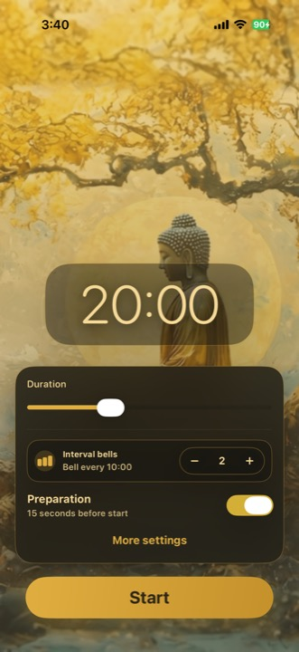
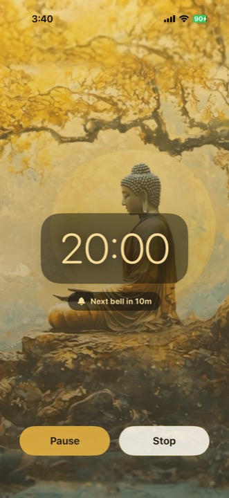

# Golden Meditation Timer

Golden Meditation Timer is an iOS-first meditation timer. The production iPhone app is native SwiftUI, while the React + Vite code lives under `web/` as the web layer.

Much gratitude toward [Gongmeister](http://gongmeister.app/) for the inspiration. Golden Meditation Timer adapts the idea for my own practice preferences, reliable background running when the app is closed (good for walking meditation), and other practice-specific flows close to daily life.

## Screenshots

<p>
  
  
</p>

## Start Here

- iOS app notes: [`ios/README.md`](ios/README.md)
- Web source: [`web/`](web/)

## Common Commands

```sh
npm install
npm run build
npm run ios:install
npm run ios:open
```

## Web Deployment

For Vercel, keep the project root at the repository root. `vercel.json` sets the build command to `npm run build` and the output directory to `web/dist`.
